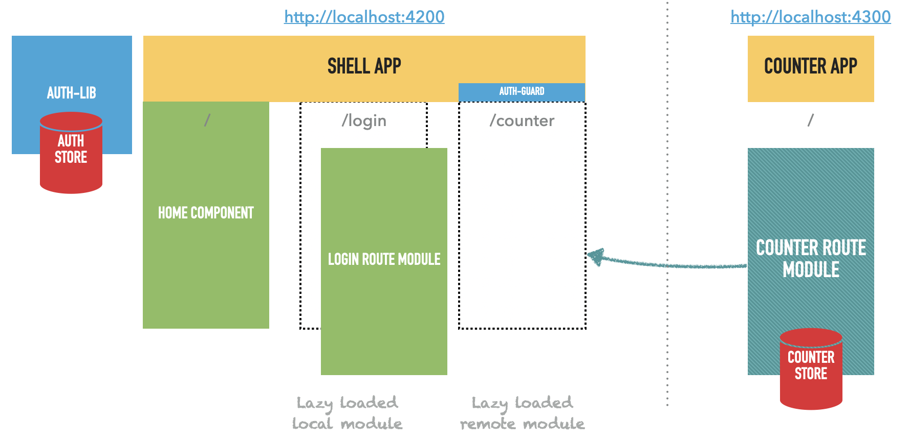
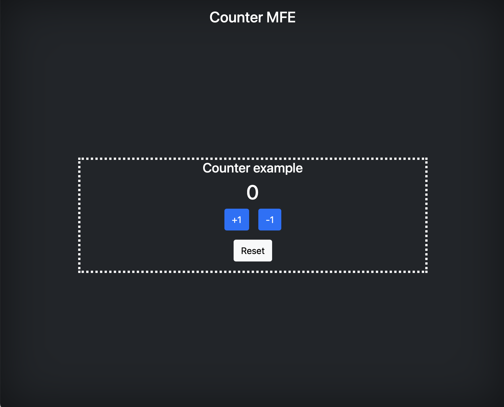
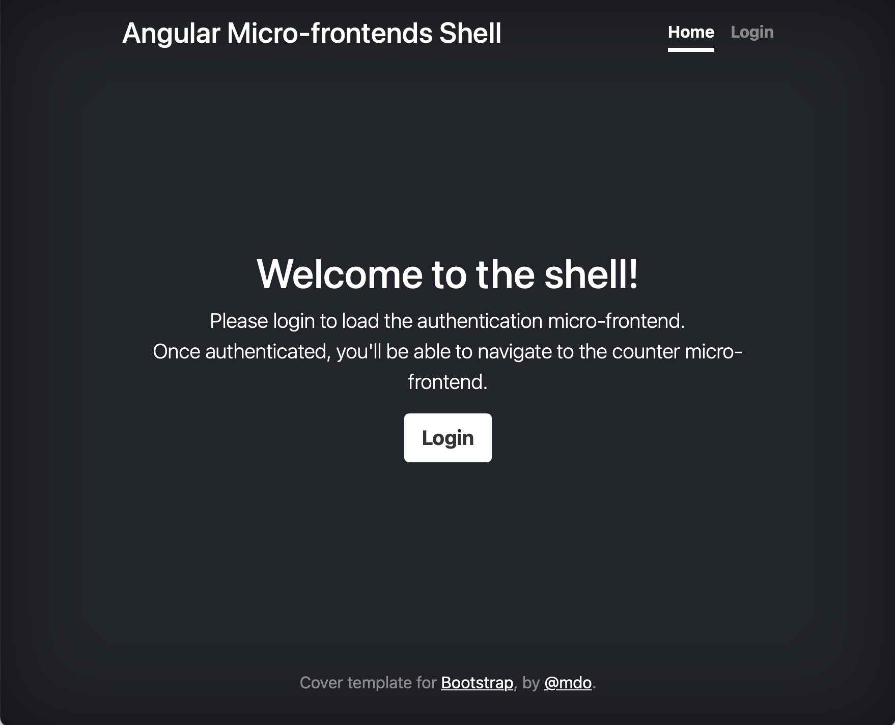
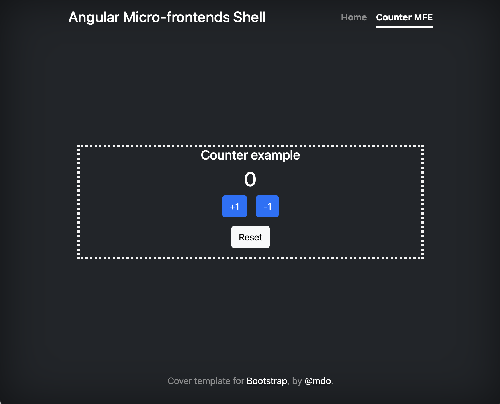

# Micro-frontends Advanced Demo

This is a demo used as a proof of concept to build a micro-frontends architecture with [Angular 11](http://angular.io), [Nx Workspace](https://nx.dev/angular) and [Ngrx Store](http://ngrx.io).

The demo is based on two apps:
- a **counter-mfe** micro-app with a Counter module, which provides a working counter feature with it's own `counter` ngrx store (state and actions),
- a main **shell** app which provides the default home page, an authentication feature with it's own `auth` ngrx store (state and action) from an auth lib. 

Once authenticated on the shell app, it's possible to navigate to the counter feature and loads the remote Counter module from **counter-mfe** app.



Note: for a more basic demo, you might check [MFE basic demo](https://github.com/benorama/mfe-basic-demo), with a step-by-step guide to create and configure a micro-frontend workspace. 

Note 2: the initial workspace was created with Nx CLI.

```
npx create-nx-workspace@latest mfe-advanced-demo --preset="angular" --appName="shell" --style="scss"
ng g @nrwl/angular:app mfe1
```

## Running the demo apps

Run the **counter-mfe** micro-app and go to http://localhost:4300.

```
nx serve counter-mfe
```



Run the **shell** main app and go to http://localhost:4200.

```
nx serve shell
```



Login and navigate to Counter MFE, which will load the Counter module from the **counter-mfe** micro-app.


